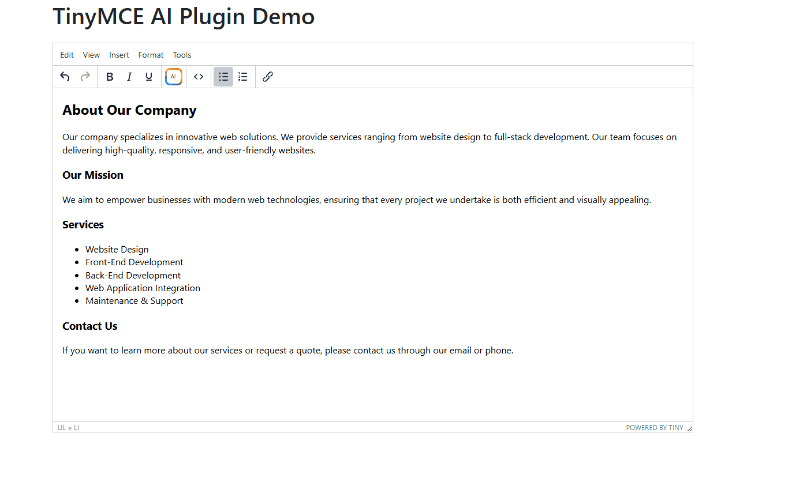

# TinyMCE AI Assistant Plugin
> **Tested on** TinyMCE 5.10.2

This TinyMCE plugin adds an **AI-powered assistant** to your editor that can modify HTML/CSS content based on user instructions. It integrates with a **Hugging Face proxy server** (`hf-proxy.php`) to send instructions and receive AI-generated HTML/CSS. The plugin shows a preview inside an iframe and lets users apply the generated result to the selected content or the whole document.

---

---

## Project structure

```
ai/
├─ plugin.min.js          # TinyMCE plugin file (place into tinymce/plugins/ai/)
api/
├─ hf-proxy.php           # Server-side Hugging Face proxy (place into /api/hf-proxy.php)
```

- `ai/plugin.min.js` → put into `tinymce/plugins/ai/` (or your plugin folder)
- `api/hf-proxy.php` → put into your server root `/api/hf-proxy.php`

> If you host `hf-proxy.php` somewhere else, change the fetch URL inside the plugin:
> ```js
> fetch('/api/hf-proxy.php', { // ! ! ! ! HF-PROXY.PHP PATH ! ! ! !
> ```

---

## Features

- Edit or improve selected HTML/CSS or the entire document using AI instructions.
- Preview AI-generated content inside a sandboxed iframe (with optional CSS libs loaded).
- Remove preview-only styles before insertion (link tags, `<base>`).
- Toolbar button + menu item for easy access.
- Optional server-side logging in the `hf-proxy.php` proxy.

---

## Installation

1. Copy plugin to TinyMCE plugins folder:

```
tinymce/plugins/ai/plugin.min.js
```

2. Copy proxy to your server:

```
/api/hf-proxy.php
```

3. Add the plugin to TinyMCE initialization:

```js
tinymce.init({
  selector: '#editor',
  plugins: 'ai',        // include the plugin
  toolbar: 'ai',        // add the AI button to the toolbar
  menu: {
    edit: { title: 'Edit', items: 'undo redo | ai' } // optional: add menu item
  }
});
```

---

## Configuration

### 1) Hugging Face API key

Open `api/hf-proxy.php` and set your Hugging Face token:

```php
$hf_api_key = "hf_fe____%PUT YOUR API KEY HERE%____";
```

Get a token at: https://huggingface.co/settings/tokens

### 2) Proxy path

If `hf-proxy.php` is not served at `/api/hf-proxy.php`, edit the plugin and change the `fetch()` URL:

```js
fetch('/api/hf-proxy.php', { ... })
```

to your proxy URL, for example:

```js
fetch('/my/custom/path/hf-proxy.php', { ... })
```

### 3) CSS libraries for preview

The plugin loads a list of CSS files into the preview iframe so generated HTML looks correct.

Edit the `cssFiles` array inside the plugin:

```js
var cssFiles = ['css/bootstrap.min.css', 'css/all.min.css'];
```

- Add any CSS files your content needs (paths must be reachable from the page that hosts TinyMCE).
- These styles are loaded **only** into the preview iframe and are removed before inserting content into the editor.

### 4) Model and payload (server-side)

### 5) Customize the server-side system prompt

The proxy (`api/hf-proxy.php`) sets a **system prompt** that tells the AI how to behave. You can change this prompt to better match your workflow, supported frameworks, or coding standards.

Open `api/hf-proxy.php` and look for the system message in the `$messages` array (it's the `system` role). By default it contains:

```text
You are an expert web developer. Edit and improve HTML/CSS for Bootstrap v4.5.3 and jQuery v3.5.1 integrations. If the user ask about icons he mean Font-awesome icons. (Free 6.6.0)Return only the modified HTML/CSS code without any explanations, comments, or additional text and do not include <html> and <head> tags or anything similar - only the inside of the <body> - if some additional styles or scripts are neccassary do not place them at the top of the code, and never include or import any additional libraries. Always return the entire response inside a single code block marked exactly as ```html ```
```

**Tips when editing the prompt**

- Keep the instruction **server-side** (do not place the API key or the prompt in client code).
- Be explicit about the exact output format you expect. For example:
  - Require the AI to return **only** the modified HTML/CSS (no explanations).
  - Require the AI to wrap code in a single code block using ````html``` and nothing else.
  - Request that the AI **not** include `<html>`, `<head>`, or top-level `<script>`/`<link>` tags—only content that belongs inside `<body>`.
- If you use a different CSS framework (Tailwind, Bulma, Bootstrap 5, etc.), update the prompt to mention that framework.
- If you want the AI to follow your project's code style (indentation, attribute ordering, class-naming), add those details to the prompt.

After changing the prompt, save the PHP file and test generating content in the TinyMCE dialog to confirm the AI outputs the expected structure.


`hf-proxy.php` sends the request to the Hugging Face chat completion endpoint. You can change the model in the PHP script:

```php
$model = "deepseek-ai/DeepSeek-V3.2-Exp:novita"; // example
```

Or choose another supported model there. Also double-check `max_tokens`, `temperature`, etc. in the PHP file to tune results.

---

## Usage

1. Open TinyMCE editor.
2. (Optional) Select the HTML you want to modify. If nothing is selected, the whole document will be used.
3. Click the **AI Assistant** toolbar button (or menu item).
4. Type instructions in the dialog (e.g. "Make buttons more accessible and modern using Bootstrap 4.5.3").
5. Click **Generate** — wait for the AI to respond. A preview will appear.
6. Click **Apply** to replace the selection (or entire content) with AI result.

---

## Logging (optional)

`api/hf-proxy.php` supports basic logging controlled by two flags:

```php
$DEBUG_LOGGING = true; // debug metadata -> hf-proxy-debug.log
$QUERY_LOGGING = true; // instruction/content logs -> _hf-query-logs.log
```

- Logs are written to files in the same folder as the PHP script.
- Turn them off (`false`) in production for performance/security.

---

## Security & privacy notes

- The plugin sends user-provided HTML and instructions to your server proxy, which forwards them to Hugging Face. Make users aware that their content is processed by a third-party model.
- Protect `hf-proxy.php` access and keep the Hugging Face API key secret (do not embed it in client-side code).
- Consider adding authentication or rate limiting to the proxy in production.

---

## Troubleshooting / FAQ

**Q: Preview looks broken / CSS not applied?**  
A: Ensure the `cssFiles` paths are correct and reachable from the page. They are loaded inside the iframe — relative paths are resolved relative to the host page.

**Q: The plugin never applies content / Apply button stays disabled?**  
A: Generate must complete successfully. Check browser console and server logs. The plugin expects a JSON response with `modifiedContent`. Example:
```json
{ "modifiedContent": "<div>...</div>" }
```

**Q: I changed the proxy path but still get 404?**  
A: Double-check the `fetch()` path inside `plugin.min.js`. Also ensure your server serves the PHP file from that path (and PHP is enabled).

**Q: How to prevent external CSS from being inserted into my editor?**  
A: The plugin strips `<link rel="stylesheet">` tags and `<base>` tags from AI output before inserting it.

---

## Example workflow

1. Select content in editor (or not).
2. Click **AI Assistant**.
3. Type: `Refactor this HTML to use Bootstrap 4.5.3 card layout and make it mobile-friendly.`
4. Click **Generate**.
5. Review preview inside dialog.
6. Click **Apply** to insert the result.

---

## Contributing

1. Fork the repository.
2. Create a feature branch: `git checkout -b my-feature`
3. Commit changes and open a pull request.

If you improve the plugin (translations, additional safety checks, better preview handling), please send a PR.

---

## License

This project is open-source under the **MIT License**. See `LICENSE` for details.

---

## Changelog

- v1.0 — Initial release: plugin + proxy, preview iframe, selection support, basic logging.

---
